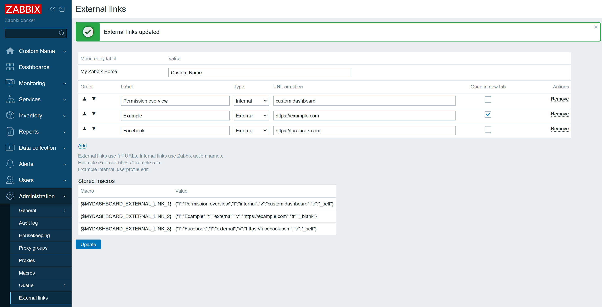

# Zabbix Custom My Dashboard

Custom My Dashboard is a Zabbix frontend module that provides a personal dashboard with a consolidated permissions overview and user context on a single page. These capabilities are not available out of the box in Zabbix and are designed to reduce the need to navigate across multiple pages.





## Highlights
- Shows user details, user groups, host group permissions (RW/RO/Deny), and services access in one place.
- Shows the current user's media types and notification settings even for users with role "user role".
- Addresses a Zabbix limitation: users with role "user role" cannot see their media configuration under "User profile".
- Supports adding custom links under the "My Zabbix Home" menu entry.

## Features
- Single-page permission overview that is not available out of the box.
- Media type visibility for role "user role" users, which is not available out of the box.
- Menu extension point for custom links.

## Requirements
- Zabbix 7.0+ (inc 7.2 and 7.4)

## Installation
1) Create a folder in your Zabbix server modules directory (by default `/usr/share/zabbix/`) and copy this repository into `Custom-My-Dashboard`.
2) Go to Administration -> General -> Modules, click Scan directory, and enable the module.
3) Open the menu "My Zabbix Home" -> "Permission overview".

## Usage
- Open "My Zabbix Home" -> "Permission overview" to review role, groups, and permissions on a single dashboard.
- Check media type configuration and schedules without needing access to User profile.
- Manage custom menu links under Administration -> External links.

## Custom links
The module extends the main menu by adding a "My Zabbix Home" section. You can add one or more links that appear under this section using the External links page.

When the module is enabled, it creates the first link macro (`{$MYDASHBOARD_EXTERNAL_LINK_1}`) for the Permission overview page (`custom.dashboard`). Additional links you add start from `{$MYDASHBOARD_EXTERNAL_LINK_2}`.

### User-level custom links
Users can manage their own links without Administration access by going to User settings -> Custom links. These links are stored per user and appear under a personal "User Link" menu entry (label can be customized on the same page).

## Menu label override
You can rename the "My Zabbix Home" menu entry by creating a global macro:
- `{$MYDASHBOARD_MENU_ENTRY}`: custom label shown in the main menu.

You can also manage this value directly from Administration -> External links.

### Configure links
1) Go to Administration -> External links.
2) Click Add to insert a row.
3) Fill in:
   - Label: menu text.
   - Type: External or Internal.
   - URL or action: full URL for External, Zabbix action name for Internal (example: `userprofile.edit`).
   - Open in new tab: optional.
4) Click Update to save.

### Macro storage
Links are stored as global macros, one per link, using the singular prefix:
- `{$MYDASHBOARD_EXTERNAL_LINK_1}`
- `{$MYDASHBOARD_EXTERNAL_LINK_2}`

Each macro value is JSON encoded and contains:
- `l` label
- `t` type (`external` or `internal`)
- `v` value (URL or action)
- `tr` target (`_self` or `_blank`)

Example value:
```json
{"l":"Zabbix Docs","t":"external","v":"https://www.zabbix.com/documentation","tr":"_blank"}
```

If you remove all rows and save, all related macros are deleted.

## Notes
- The module uses standard Zabbix permissions for viewing host groups and services.
- Media rendering matches the built-in user profile media table for consistency.
